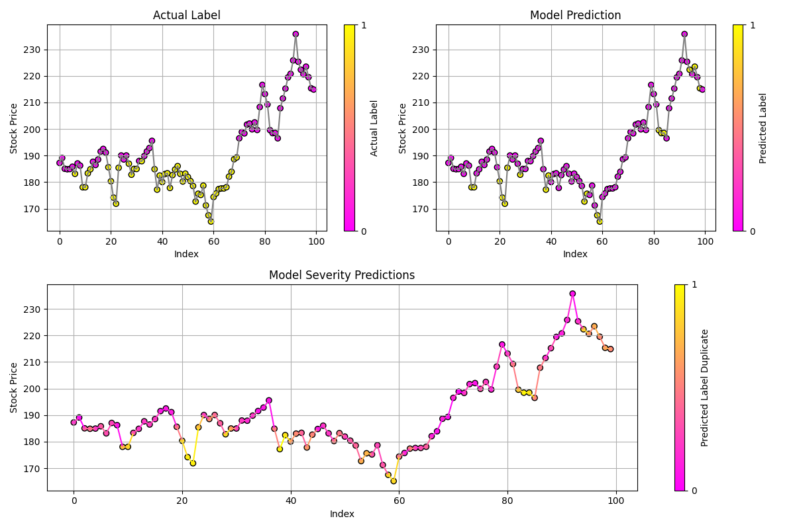

## What Does the Model Do?

At its core, this system is a **binary pattern-recognition engine**. Instead of guessing a exact dollar price, it answers one simple question: **"Based on recent price trends, is this stock's price about to go UP or DOWN?"**

## 1. The Inputs: What Does the Model Look At?

The model doesn't care about market news or earnings reports—it relies purely on **recent price momentum**.

* **6 Relative Price Deltas:** The pipeline pulls 7 consecutive trading days of closing stock prices (using Yahoo Finance).
* **Percentage Changes:** It calculates the relative percentage change ($\Delta_i$) between consecutive trading days:

$$\Delta_i = \frac{P_i - P_{i+1}}{P_{i+1}}$$

* **The Input Vector:** These **6 consecutive percentage changes** form the exact numeric footprint fed into the model.

## 2. The Engine: How Does It Process the Data?

The system uses a **Deep Neural Network** built with TensorFlow/Keras:

* **Pattern Extraction:** The 6 price deltas pass through multiple dense layers ($32 \rightarrow 16 \rightarrow 4 \rightarrow 16$ neurons) that extract complex, non-linear relationships in price movement.
* **Noise Reduction:** Techniques like **Dropout** and **L2 Regularization** are used during training so the network learns true underlying patterns rather than memorizing random market noise.
* **Custom Risk Weighting:** The model was trained with a custom loss function with a heavier weighting towards negative results. This forces the model to be extra cautious and heavily penalize false positives to prevent loss of investments on the contrary to missed opportunities.

## 3. The Output: How Does It Make a Call?

* **Raw Score:** The network finishes with a Sigmoid activation layer that outputs a continuous score between $0$ (0% confidence) and $1$ (100% confidence).
* **Decision Threshold ($0.65$):** Rather than using a standard $0.50$ coin-flip cutoff, the backtester applies a **$0.65$ threshold**. A predicted score must cross **65% confidence** to trigger a positive (buy/upward) call. This value can be adjusted depending on the user's preferences and allowed risk.

## 4. Summary Table for Quick Reference

| Step | Action | Practical Example |
| --- | --- | --- |
| **1. Data Ingestion** | Pulls last 7 trading days of closing prices via `yfinance`. | Daily closes for $SWTSX$ over 7 days. |
| **2. Feature Calculation** | Computes 6 daily percentage deltas. | `[+0.5%, -1.2%, +0.8%, +0.2%, -0.4%, +1.1%]` |
| **3. Inference** | Feeds vector into `penny.keras`. | Model evaluates momentum pattern. |
| **4. Confidence Check** | Compares scaled output score to $0.65$ cutoff. | Score $= 0.72 \rightarrow$ **Signal: UP ($1$)**. |

## 5. Current model metrics
The following metrics are based on a randomized sample from a company in S&P500 over the span of 100 days, resulting in 100 model predictions. Please note results may vary.

### Confidence Map

### Metrics
| Metric | Value | Description |
| --- | --- | --- |
|Correct Predictions | 59.00% | Predicted Correct Growth |
| False Positives | 6.00% | Predicted Growth, Actually a Loss |
| False Negatives | 35.00% | Predicted Loss, Actually Grew |
| Precision | 68.42% | Accuracy of the Predicted Investments (Did it grow?) |
| Recall | 27.08% | Investment Opportunities taken |

Using the advice the model (Penny) created. We implemented a test investment where we compared Dollar-Cost Averaging (DCA), a very well regarded investment strategy. The following is the results:
|     | **Penny** | **DCA** |
| --- | --- | --- |
|Total Invested| $4,000.00 | $4,000.00|
|Current Value| $4,585.40 | $4,456.68 |
| Gain | $585.40 | $456.68 |
| Total Investments | 19 | 50 |
|Investments w/ Loss| 3 | 7 |
| Avg. Investment | $210.53 | $80.00 |
| Estimated Yearly Interest | 33.36% | 26.51% |
